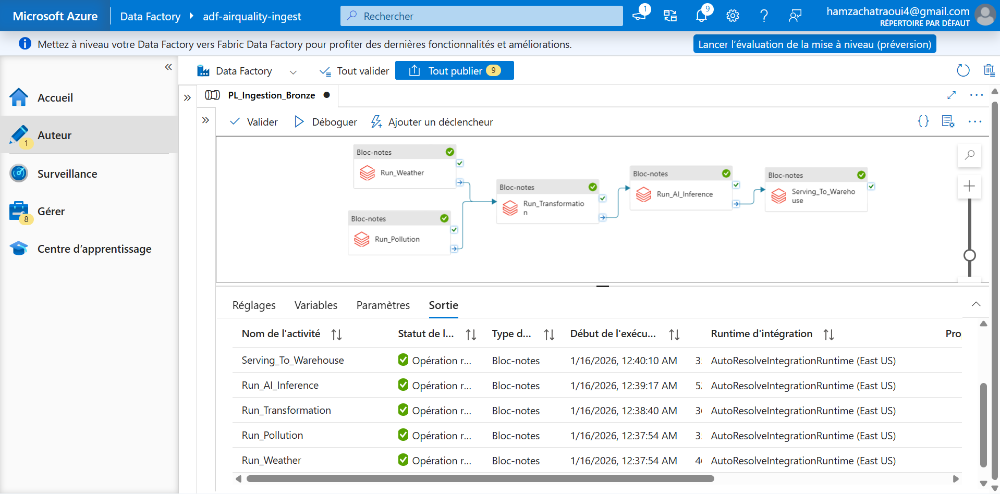
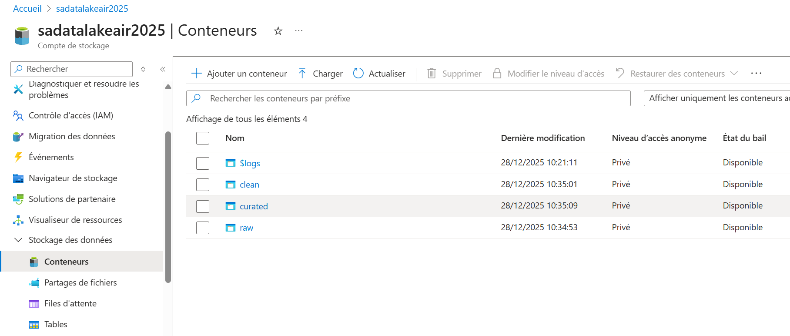
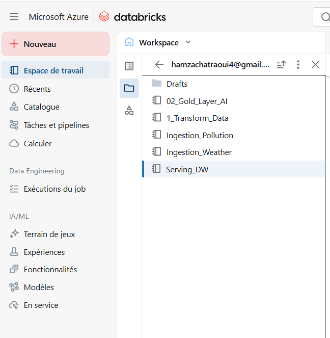
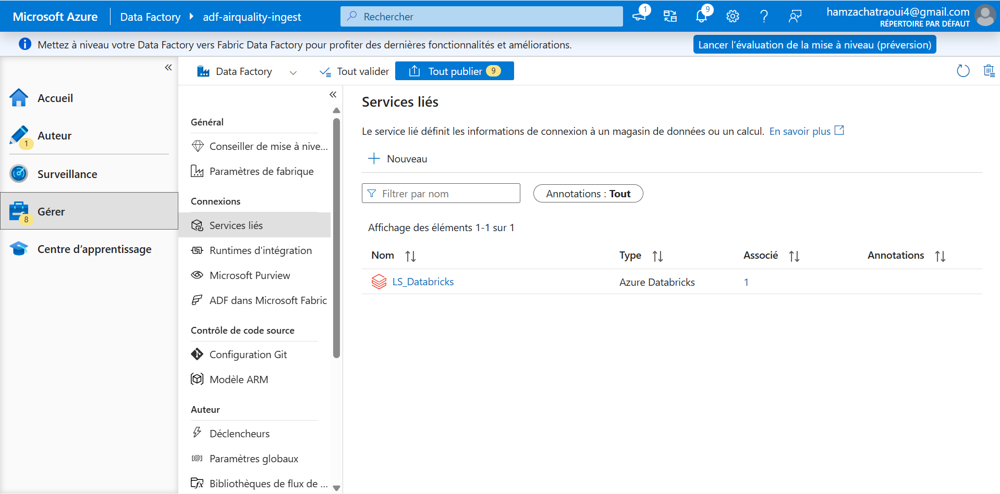
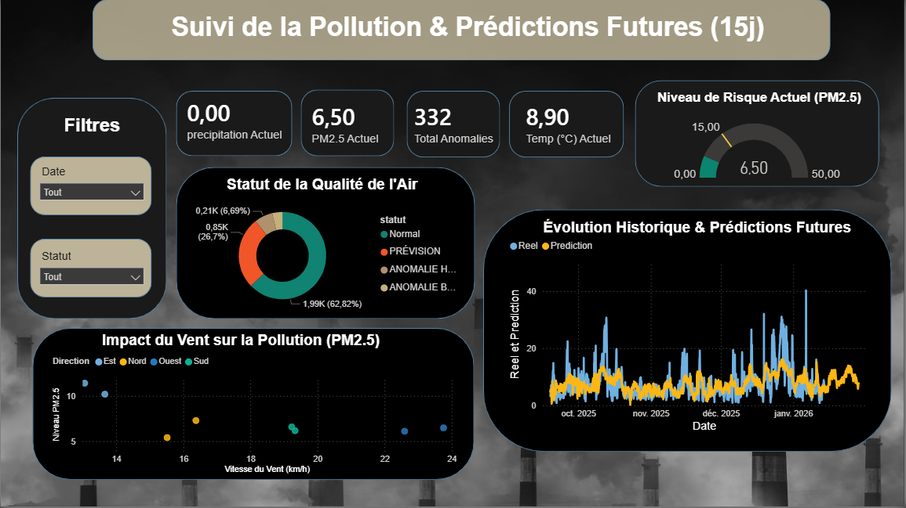

# 🌍 End-to-End Air Quality Forecasting Project (Azure & Spark)

   

## 📋 Project Overview
This project is an **End-to-End Data Engineering & Machine Learning pipeline** built on Microsoft Azure. It monitors air quality (PM2.5) in real-time and forecasts future pollution levels using weather data.

The system ingests data from public APIs, processes it using a **Medallion Architecture (Bronze, Silver, Gold)** in Databricks, and serves predictions via **Azure Synapse Analytics** to a **Power BI** dashboard.

### 🎯 Key Goals:
* Ingest massive weather & pollution data.
* Implement a **Lakehouse Architecture**.
* Train a Machine Learning model (**Prophet**) for forecasting.
* Automate the workflow using **Azure Data Factory**.
* Visualize insights for decision-making.

---

## 🏗️ Architecture & Pipeline
The project follows a modern data platform architecture:


*(Figure 1: Full Pipeline Orchestration in Azure Data Factory)*

### 🛠️ Tech Stack:
* **Ingestion:** Azure Data Factory (ADF), Python (Requests).
* **Storage:** Azure Data Lake Gen2 (ADLS).
* **Processing:** Azure Databricks (PySpark).
* **Warehousing:** Azure Synapse Analytics (Dedicated SQL Pool).
* **Orchestration:** Azure Data Factory.
* **Visualization:** Power BI.

---

## 🔄 Data Flow (The Medallion Layer)

The data moves through three key layers stored in ADLS Gen2:



### 1. Bronze Layer (Raw Ingestion)
* **Source:** OpenAQ API (Pollution) & Open-Meteo API (Weather).
* **Process:** Raw JSON data is ingested "as-is" into the Data Lake.
* **Code:** `Notebooks/Ingestion_Pollution.ipynb` & `notebooks/Ingestion_Weather.ipynb`.

### 2. Silver Layer (Transformation & Cleaning)
* **Process:** Cleaning data, handling missing values, converting types, and joining Weather & Pollution datasets.
* **Technology:** PySpark on Databricks.
* **Code:** `Notebooks/1_Transform_Data.ipynb`.

### 3. Gold Layer (Machine Learning & Aggregation)
* **Process:** Feature Engineering and training the **Prophet** model to predict PM2.5 levels for the next 15 days.
* **Output:** Final predictions stored in Delta format.
* **Code:** `notebooks/02_Gold_Layer_AI.ipynb`.


*(Figure 2: Databricks Notebooks execution)*

---

## 🏭 Serving & Orchestration

### Azure Synapse Analytics
The final predictions are moved from the Data Lake (Gold) to a **Dedicated SQL Pool** in Synapse for high-performance querying.
* **Code:** `notebooks/Serving_DW.ipynb`.

### Azure Data Factory (ADF)
A fully automated pipeline triggers the notebooks in sequence:
`Ingestion` → `Transformation` → `AI Inference` → `Serving`.


*(Figure 3: Linked Services configuration in ADF)*

---

## 📊 Dashboard & Insights

The final output is an interactive Power BI dashboard that allows users to monitor real-time risks and view 15-day forecasts.



**Key Insights:**
* Correlation between Wind Speed and PM2.5 concentration.
* Alert system for high pollution days.
* Comparison between Actual vs. Predicted values.

---

## 🚀 How to Run
1.  **Clone the repository:**
    ```bash
    git clone [https://github.com/YourUsername/AirQuality-Azure-Project.git](https://github.com/YourUsername/AirQuality-Azure-Project.git)
    ```
2.  **Setup Azure Resources:**
    * Create Data Lake Gen2, Databricks Workspace, and Synapse Analytics.
3.  **Configure Credentials:**
    * *Note: All API keys and secrets in the notebooks have been masked with "xxxxx". You must replace them with your own Azure Keys and OpenAQ API token.*
4.  **Upload Data:**
    * Upload the notebooks to Databricks.
5.  **Trigger ADF:**
    * Import the pipeline JSON (optional) or recreate the flow connecting the notebooks.

---

## 👤 Author
**[Chatraoui Hamza]**
* *Engineering Student - Big Data & Information Systems*
* [linkedin.com/in/chatraoui-hamza]

---
*Note: This project is part of an academic portfolio demonstrating Cloud Data Engineering skills.*
